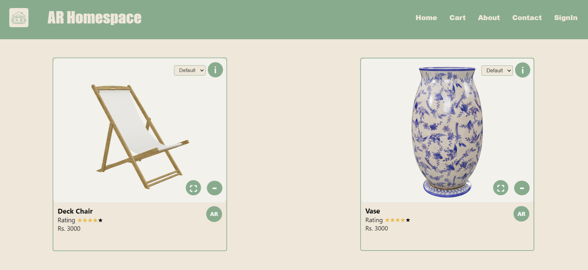
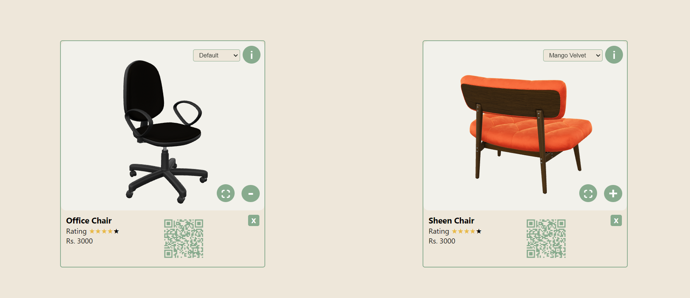
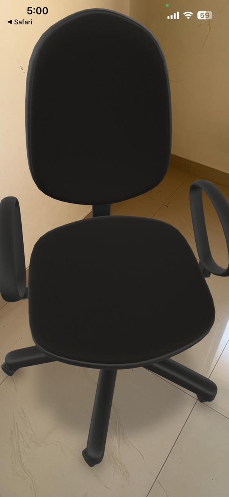
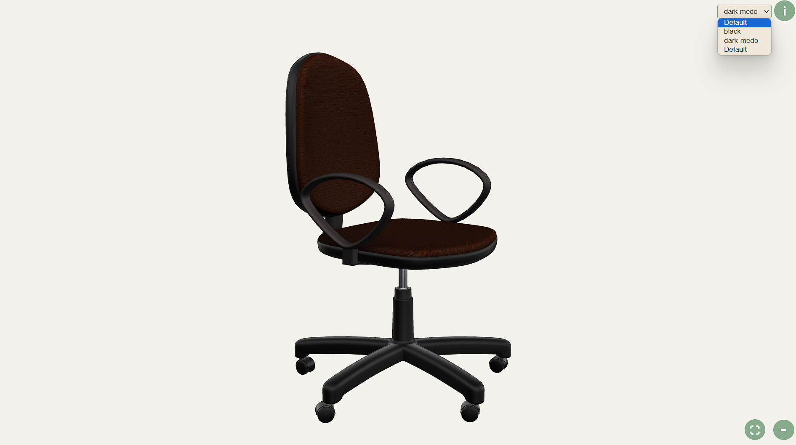

# AR HomeSpace

Welcome to **AR HomeSpace**! This is an e-commerce website dedicated to home decor products. Our unique feature allows you to view our products in Augmented Reality (AR) mode, so you can see how they fit into your space before making a purchase.

## Website

Visit the website here: [AR HomeSpace](https://ar-homespace.vercel.app)

## Features

- **Augmented Reality**: View our products in AR to see how they look in your home.
- **Wide Range of Products**: Browse through a variety of home decor items.
- **User-Friendly Interface**: Easy navigation and product viewing experience.

## How to Use

1. **Browse Products**: Visit our website and explore the wide range of home decor items available.
2. **Scan QR code**: Scan the QR by clicking on "AR" button on the product item tile, so that you can have AR experience on your mobile.
3. **View in AR**: Select a product and click on the "View in AR" button to see how it looks in your space. Ensure you have an AR-enabled device for the best experience.
4. **Add to Cart**: Once you find the perfect item, add it to your cart.
5. **Checkout**: Proceed to checkout, enter your details.

## Installation

If you wish to run this project locally, follow the steps below:

1. **Clone the repository**:
    ```sh
    git clone https://github.com/yourusername/ar-homespace.git
    ```
2. **Navigate to the project directory**:
    ```sh
    cd ar-homespace
    ```
3. **Install dependencies**:
    ```sh
    npm install
    ```
4. **Run the development server**:
    ```sh
    npm run 
    ```
5. Open your browser and visit `http://localhost:3000`.

## Contributing

We welcome contributions! If you have any ideas, suggestions, or bug fixes, please open an issue or create a pull request.

## Contact

For any inquiries or support, please contact us at atharvadoifode@gmail.com.

Thank you for visiting AR HomeSpace! We hope you enjoy your shopping experience.
## Screenshots

<p align="center">
  
  
  
  
  
</p>
